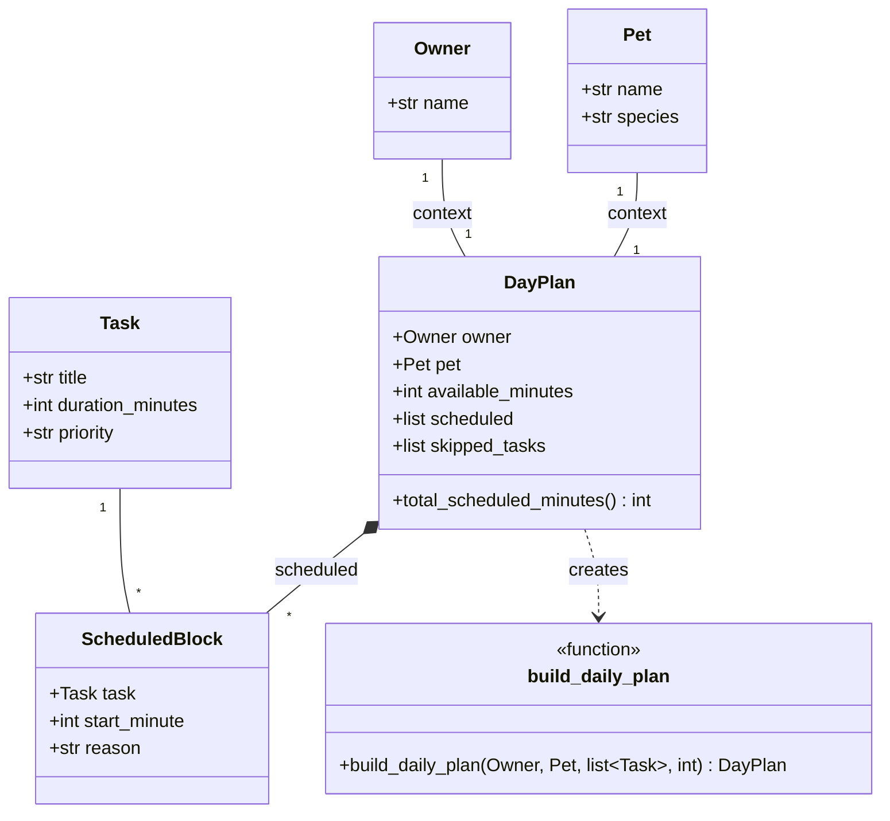

# PawPal+ UML (class diagram)

This diagram matches the implementation in the `pawpal` package.

**Responsibilities**

- **Owner** / **Pet**: Hold basic identity for the plan header and context.
- **Task**: One care item with duration and priority (`low` / `medium` / `high`).
- **ScheduledBlock**: A chosen task placed at `start_minute` with a short explanation.
- **DayPlan**: Full result: what fit in the time budget, what was skipped, and totals.
- **build_daily_plan**: Pure scheduling function—sorts by priority, packs greedily into `available_minutes`, and builds reasons.
